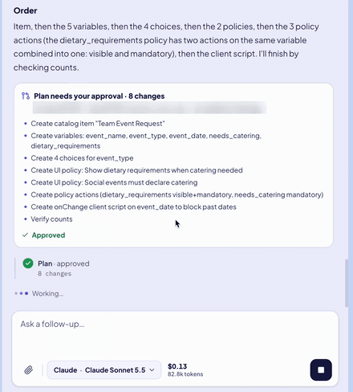

# SN AI Copilot

An open-source Chrome extension that puts an AI assistant in a side panel next to ServiceNow. Ask about the page you're on, research flows and scripts, debug behavior, and make changes through an approval-gated agent — using your own Claude, OpenAI or OpenRouter API key.

<p align="center">
  
</p>

<p align="center">
  ▶️ <b><a href="https://youtu.be/2L_xw-tpbrc">Watch the 3-minute walkthrough</a></b>: install, your first request, and building a catalog item.
</p>

<p align="center">
  <a href="#install">Install</a> · <a href="#set-up-two-minutes">Set up</a> · <a href="#environments-and-safety">Safety</a> · <a href="#privacy">Privacy</a>
</p>

> **Not affiliated with ServiceNow, Anthropic, OpenAI or OpenRouter.** ServiceNow is a trademark of ServiceNow, Inc.; the other names are trademarks of their owners. This is an independent community project.

## What it does

- **Understands the page you're on** — instance, table, record, form fields and values, list or form, UI type.
- **Researches** — queries records, table schemas, choice lists and counts; reads Flow Designer flows, legacy workflows, business rules, client scripts, script includes, ACLs and catalog items; searches script bodies for a field, table or error message.
- **Makes changes you approve** — creates, updates and deletes records, including catalog items, variables, UI policies and client scripts. Changes are never made on instances you mark Production, and never without your approval.
- **Works like a chat app** — streaming answers, markdown tables and code with copy buttons, text/document/spreadsheet and image attachments, Cmd/Ctrl+F search, and a read-only **History** of past conversations.
- **Keeps working when you look away** — a run belongs to the extension's background worker, so you can close the panel or switch tabs; if Chrome restarts the worker, the run is reported and can be resumed.
- **Shows what each chat costs** — tokens and dollars for the current chat, live beside the model picker, with a breakdown a click away; each chat's total is saved with it in History.
- **Lets you set how hard the model thinks** — for models that take a reasoning effort, the model picker shows exactly the levels that model accepts. Leave it on **Default** and the model uses its own setting.

## Requirements

- **Chrome 116 or later** (or another Chromium browser with the Side Panel API).
- **An API key** from at least one of [Anthropic](https://console.anthropic.com/), [OpenAI](https://platform.openai.com/api-keys) or [OpenRouter](https://openrouter.ai/keys). Usage is billed by that provider to your account.
- **A ServiceNow instance on `*.service-now.com`** you can sign in to. A free [Personal Developer Instance](https://developer.servicenow.com/) is perfect for trying it out.
- **Node.js 22.22+ or 24.15+**, only if you build it yourself (`.nvmrc` is included).

## Install

The extension is not on the Chrome Web Store. The built extension is included in the repository's `dist/` folder, so there is nothing to build. Get the code:

```bash
git clone https://github.com/gyaujosh/SN-AI-Copilot.git
```

Or click **Code → Download ZIP** at the top of this page and unzip it.

Then load it into Chrome:

1. Open `chrome://extensions` and switch on **Developer mode**.
2. Click **Load unpacked** and choose the `dist/` folder.
3. Pin the extension if you like, open a ServiceNow tab, and click the extension's icon. The side panel opens.

To update later: `git pull` (or download the ZIP again), then click the reload icon on the extension's card in `chrome://extensions` and refresh any open ServiceNow tabs once.

To build it yourself instead (after changing the code, or to check that `dist/` matches the source): `npm ci && npm run build`.

## Set up (two minutes)

1. **Add an API key.** In the panel, open **Settings → AI Access**, expand a provider and paste your key. It is checked straight away ("Key saved · 42 models", or "Key rejected"). The first key you add becomes the provider in use; after that, switching providers is always your choice — deleting a key never moves your conversation to another provider.
2. **Pick a model (optional).** The model button in the message box lists the provider's current models, fetched live. Until you pick one, a sensible default is chosen from that list — the newest Claude Sonnet, the newest flagship GPT, or on OpenRouter a Claude Sonnet or GPT route.
3. **Add your instances.** In **Settings → Instances**, add each instance and choose its environment. The tab you are looking at is offered with one click, and the environment is suggested from its name — check it before saving. The agent can work on an instance you haven't added too, asking before every change; add production instances as **Production** so they stay read-only.
4. **Ask.** Try "Explain the record I'm on", "What does this flow do?", or "Why isn't this business rule firing?".

## Environments and safety

Every instance has an environment, and the environment decides what the agent may do there:

| Environment | Reads | Changes |
| --- | --- | --- |
| Sandbox, Development, Test, Stage | Yes | Yes, after you approve |
| Not added in Settings | Yes | Yes, after you approve |
| Production | Yes | Never |

**Add your production instances as Production.** An instance you never added accepts changes like a development one, and its approval cards say "not added in Settings" so you can tell.

- **You approve the plan once.** When you ask the agent to build something, it writes out the full plan in Markdown — records, field values, the users or items it uses, the order — and right below it shows every step on one approval card. Approve it and the agent builds the whole plan in that response without asking again: creates, updates, deletes, group members and roles alike. Reject it and nothing changes. Your next request, or a new plan, asks again. Unanswered requests expire after 10 minutes.
- The plan card is in the agent's words, so read it before approving. If the agent makes a change without a plan, the card describes it from the request itself — table, record and the fields being set — and approving it covers the rest of that response.
- An approval is permission, not a result: each step shows whether the change succeeded, failed, or has an **unknown outcome** that must be verified. A change whose outcome is unknown is never repeated automatically.
- The environment is re-checked before every batch of changes: mark an instance Production mid-response and its remaining changes are refused.
- Every change is checked against the record ServiceNow saves. ServiceNow silently drops a value it won't take (a field that's read-only to you, one the table doesn't have, or one a business rule clears), so the agent is told which values didn't save instead of reporting them as set.
- Requests from the agent can only reach ServiceNow's Table and Aggregate APIs, for one table or one record at a time — never another endpoint, whatever the model asks for.
- All ServiceNow calls run **in your signed-in browser tab, with your own permissions** — ACLs apply as usual, and the extension never sees your ServiceNow password.
- **Auto** (the default) works on the ServiceNow tab you are viewing. Pinning an instance from the header menu keeps the agent on it until you choose Auto again. A response always finishes on the instance it started on.

## What it costs

You pay your AI provider for what you use; the extension shows you what that is. Beside the model picker, the running total for this chat shows in dollars and tokens, updated after every model call. Click it for the breakdown: the latest answer, input, cached input and output tokens, and the number of model calls. **New chat** starts the count again at $0, and the finished chat's total is saved with it in **History**.

- **OpenRouter** reports the exact cost of each call, and that is what's shown.
- **Claude and OpenAI** don't, so cost is worked out from each model's published list price, including cache discounts and long-context rates. The table lives in [`src/background/pricing.ts`](src/background/pricing.ts), with the date it was last checked.
- A model that isn't in the price list is priced high on purpose and marked **≈**, so an estimate errs on the side of too much. An answer you stop mid-stream is still billed by the provider, so it is counted too, from the tokens it had used.
- Your provider's bill is the final word. Totals are kept only in this browser, like the rest of your history.

**Effort.** Models that reason before answering can be asked to think less or more. When you pick one in the model picker, its levels appear underneath: only the ones that model accepts, from its provider's model list (for OpenAI, from a table in [`src/shared/effort.ts`](src/shared/effort.ts), since OpenAI's list doesn't say). **Default** sends nothing, so the model uses its own setting. Higher effort is slower and uses more output tokens, so it costs more. The choice is remembered for each model, and models without an effort setting don't show one.

**The helper Script Include.** ServiceNow's REST API can't set the variable on a *catalog UI policy action*. So the first time the agent creates one on an instance, the extension installs a small client-callable Script Include, `SNAICopilotHelper`, there. It never does this silently, and approving a plan never covers it: the install always gets its own yellow approval card, right after the plan (or before the first change that needs it), which explains why the helper is needed, what it does and what installing it changes. Installing it needs the admin role. Rejecting that card installs nothing and creates none of the UI policy actions; the rest of the plan still goes ahead. It only creates `catalog_ui_policy_action` records from a fixed set of fields, and only for users with `catalog_admin` who are allowed to create actions and edit the policy. It inserts with a plain `GlideRecord`, because ServiceNow locks an action's UI policy field with a `nobody` ACL that would otherwise drop the link without an error. It then reads the action back and deletes it again if anything didn't save; the extension does the same once the variable is set, so an action is only reported as created when it is linked to its policy with its variable. Like any configuration change it is captured in your current update set, so it travels with that update set. A copy that differs from the current script is replaced before use, again only after you approve. It is safe to delete; you are asked again before it is reinstalled.

## Privacy

- **No telemetry, no analytics, no servers of ours.** The extension talks to exactly two kinds of places: your ServiceNow instance (through your own tab) and the AI provider you selected.
- **API keys** are kept in `chrome.storage.local` in this browser profile, which is closed to content scripts. Only the background worker reads them; the panel only learns whether a key exists, and a stored key is never shown again. Each key is sent only to its own provider. Use a dedicated key with a spending limit.
- **What the AI provider receives:** your messages and attachments, the current page context (URL, table, record id and form field values), and the ServiceNow data the agent reads while answering. Credential-like values — password and masked fields, tokens, API keys, secrets and sensitive-named system properties — are redacted before anything reaches the model or local storage. Anthropic, OpenAI and OpenRouter process that data under their own terms.
- **Pages can't steer the agent.** Which instance a page belongs to comes from the browser, not from the page, and instance details used in prompts (calibration) are only gathered from instances you added.
- **Conversations** are stored locally so a closed panel can reopen them; up to 30 past sessions are kept in **History**, where you can delete them.
- The Anthropic API is called directly from the browser, which requires the `anthropic-dangerous-direct-browser-access` header — the name refers to the key being present in the browser, which is the point of a bring-your-own-key extension.

### Permissions

| Permission | Why |
| --- | --- |
| `https://*.service-now.com/*` | Read page context and relay REST calls through your signed-in tab. |
| `sidePanel` | The chat UI. |
| `storage` | Settings, keys, conversation history. |
| `scripting` | Restore the page helper on an already-open ServiceNow tab after the extension updates. |
| `cookies` | Check whether a ServiceNow session exists (the `glide_user_route` cookie's presence only). |
| `activeTab` | Work with the tab you invoke the extension on. |

## Team presets (optional)

A team can ship a build with its instances pre-configured: copy `config/instances.example.json` to `config/instances.local.json`, list your instances and their environments, and build. They seed each user's instance list on first run, and users can still edit them. The local file is gitignored — see [config/README.md](config/README.md).

## Troubleshooting

- **"No ServiceNow tab"** — open the instance, or use the **Open** link in the header.
- **"Refresh the ServiceNow tab"** — the page still runs an older copy of the helper; reload it once (common right after updating the extension).
- **"Sign-in required"** — your ServiceNow session expired; sign in in that tab. The header clears itself once a request succeeds.
- **"Key rejected"** — paste a new key in **Settings → AI Access**.
- **A model isn't listed** — use **Use a model id…** at the bottom of the model list. OpenAI models that only support the Responses API cannot be used.
- **Changes are refused** — the instance is marked Production in **Settings → Instances**; every other environment, and an instance not added there, accepts changes.

## Development

```bash
npm run check        # lint, type checks, unit tests and the extension build
npm test             # unit tests only (Vitest + jsdom)
npm run preview:ui   # the real panel with fake data — no ServiceNow or AI calls
npm run licenses     # regenerate public/THIRD_PARTY_LICENSES.txt after changing dependencies
```

`npm run preview:ui` serves `http://localhost:5199/`. Query parameters: `width` (e.g. `320`, `400`, `620`), `theme` (`light`, `dark`), `text` (`sm`, `md`, `lg`), `nav` (`auto`, `pinned`), `view` (`chat`, `history`, `settings`) with `section` (`keys`, `instances`, `appearance`), and `scenario` (`empty`, `first-run`, `chat`, `streaming`, `tables`, `approval`, `approved`, `interrupted`, `stopped`, `unadded`, `error`, `no-tab`, `reconnecting`, `sign-in`, `missing-key`, `long`). For example: `http://localhost:5199/?width=320&theme=dark&scenario=chat&nav=pinned`.

**Layout:**

- `src/background/` — the service worker: the agent loop (`agent.ts`), provider adapters (`providers/`), live model catalogs (`modelCatalog.ts`), settings, the ServiceNow transport (`snBridge.ts`) and catalog helpers (`snCatalog.ts`).
- `src/content/` and `public/inject.js` — the content scripts and the page-context helper that makes REST calls with the user's session.
- `src/sidepanel/` — the React side panel.
- `src/shared/` — types and the protocol between the three.
- `test/` — unit tests and fixtures. `preview/` — the visual preview harness.

For how runs, checkpoints and connection recovery work, see [docs/how-it-works.md](docs/how-it-works.md).

## Contributing

Issues and pull requests are welcome. Please run `npm run check` before opening a PR, and keep instance-specific details (hostnames, record ids, company names) out of code, tests and fixtures — use placeholders such as `example.service-now.com`. To report a security issue, see [SECURITY.md](SECURITY.md).

## License

[MIT](LICENSE). Bundled third-party components and their licenses are listed in [THIRD_PARTY_NOTICES.md](THIRD_PARTY_NOTICES.md).
